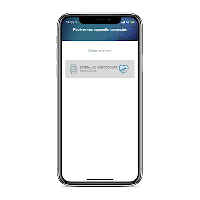

# Aura iOS

## Installation
 - Clone the project. 

 - Open it with xCode. 

 - Run on simulator or device. 

## Information

<u>Target :</u> iOS 12 & above

<u>Build variant:</u> Debug & Release

## Build VivalnkSDK
The documention of the SDK is not complete. In order to make your project build with the SDK you need also to:

 - Add a .mm file to your project
 - Add CoreLocation
 - Add in Info.plist 
	 - Privacy - Location Always and When In Use Usage  Description
	 - Privacy - Location When In Use Usage Description
- Add Capabilities > Background modes > check "Location updates"